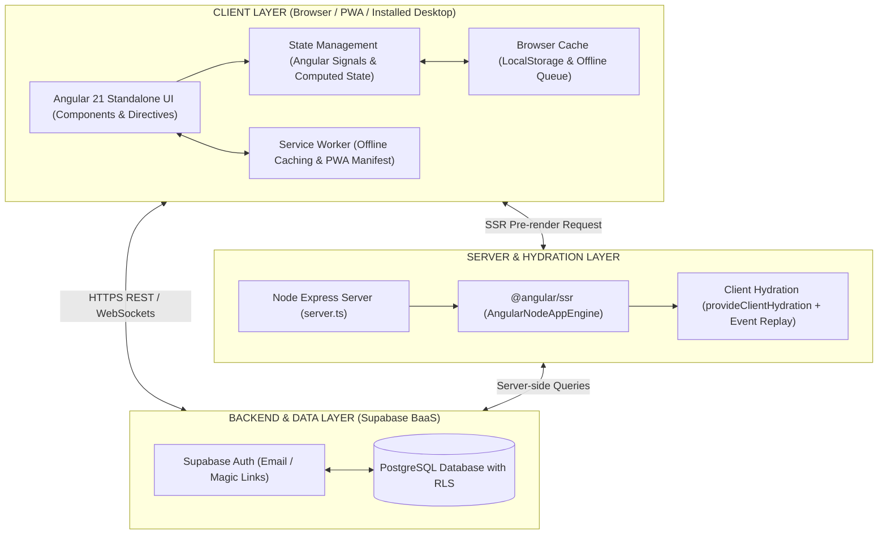
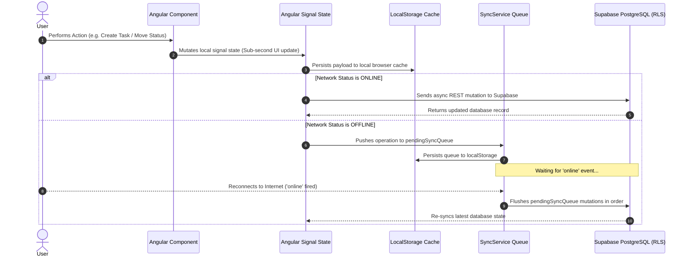
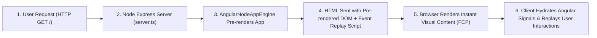
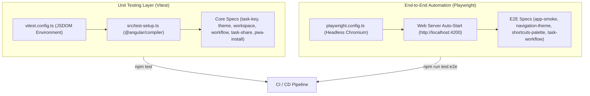

# bilo - Technical Architecture Specification

## 1. Executive Overview

**bilo** is a personal, minimalist developer project management application designed for solo developers building and maintaining software projects. It answers the core question: **"What should I work on next?"** with a fast, keyboard-driven Angular 21 architecture featuring Server-Side Rendering (SSR), Client Hydration with Event Replay, Offline PWA resilience, and PostgreSQL Row-Level Security (RLS).

---

## 2. Product Principles & Architecture Goals

1. **Minimalist & Fast**: Sub-second UI interactions, streamlined data models, keyboard-driven hotkeys (`Cmd+K`, `N`, `1-6`, `?`).
2. **Developer-First Data Model**: Built-in support for code repositories, technical notes, bug reports, custom status workflows, and styled Excel exports.
3. **Personal-First Isolation**: Strict single-user PostgreSQL Row-Level Security (RLS) data isolation.
4. **Anywhere Access**: Responsive layout, Progressive Web App (PWA) offline queueing, and Angular 21 SSR + Hydration with Event Replay.
5. **Quality Assurance**: Unit test suites powered by Vitest and End-to-End browser test automation powered by Playwright.

---

## 3. High-Level Architecture Diagrams

### 3.1 System Architecture



---

### 3.2 Offline-First Data Synchronization Sequence



---

### 3.3 Angular 21 SSR & Event Replay Hydration Lifecycle



---

### 3.4 Automated Testing Pipeline



---

## 4. Technology Stack Summary

| Layer | Technology | Purpose |
| :--- | :--- | :--- |
| **Frontend Framework** | Angular (v21+) + TypeScript | Standalone components, router binding, signals reactivity |
| **Server-Side Rendering** | `@angular/ssr` + Node Express | Pre-rendering HTML, client hydration with event replay |
| **Unit Testing** | Vitest + JSDOM | Sub-second unit tests for services, utilities, and components |
| **E2E Testing** | Playwright (`@playwright/test`) | Automated end-to-end browser user workflow testing |
| **Styling & Theme** | Modern CSS Variables & Utilities | Developer high-contrast themes (Dark/Light) |
| **Backend & Auth** | Supabase (BaaS) | Managed REST/Realtime API and Supabase Auth |
| **Database** | PostgreSQL + RLS | Relational storage with strict Row-Level Security policies |
| **App Delivery** | PWA (Service Worker + Manifest) | Fast desktop/mobile loading with offline queueing |

---

## 5. Angular Application Directory Structure

```
src/
├── app/
│   ├── core/
│   │   ├── models/          # TypeScript interfaces (Project, Task, Workflow, etc.)
│   │   ├── services/        # Supabase, Auth, Workspace, Task, Project, Workflow, Theme, Sync, PWA services
│   │   └── utils/           # Task key formatter (task-key.util.ts)
│   ├── features/
│   │   ├── today/           # "What should I work on next?" dashboard
│   │   ├── backlog/         # Task backlog and unscheduled items
│   │   ├── tasks/           # Interactive Kanban workflow board
│   │   ├── calendar/        # Monthly calendar scheduling drawer
│   │   ├── archive/         # Work history, activity audit & Excel exports
│   │   ├── settings/        # Workspace settings & status column configuration
│   │   └── auth/            # Dedicated sign in / sign up landing page
│   ├── shared/
│   │   └── components/      # UI buttons, modals, logo, workspace switcher
│   ├── app.config.ts        # Client routes & provideClientHydration(withEventReplay())
│   ├── app.config.server.ts # Server-side app config (provideServerRendering)
│   └── app.ts               # Shell root component
├── e2e/                     # Playwright End-to-End browser test suites
├── docs/                    # Technical API & Database Schema specifications (API.md)
├── main.ts                  # Client bootstrap entrypoint
├── main.server.ts           # SSR server bootstrap entrypoint
├── server.ts                # Express Node SSR server entrypoint
├── test-setup.ts            # Vitest compiler setup
├── vitest.config.ts         # Vitest test runner configuration
├── playwright.config.ts     # Playwright E2E configuration
└── styles.css               # Global theme tokens and responsive utility classes
```

---

## 6. Detailed API & Database Specification

For full method signatures, reactive signal models, and PostgreSQL schema definitions, refer to the [API & Data Specification](file:///home/habrmnc/habrmnc/bilo/docs/API.md).
